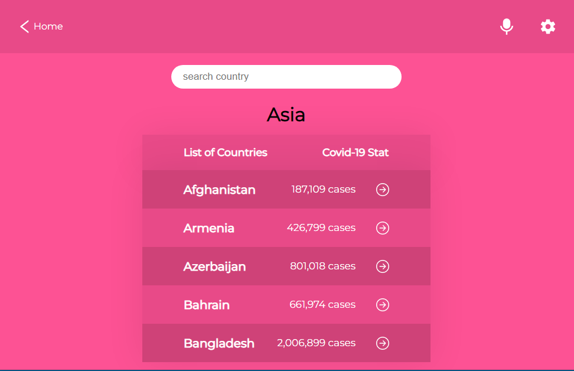
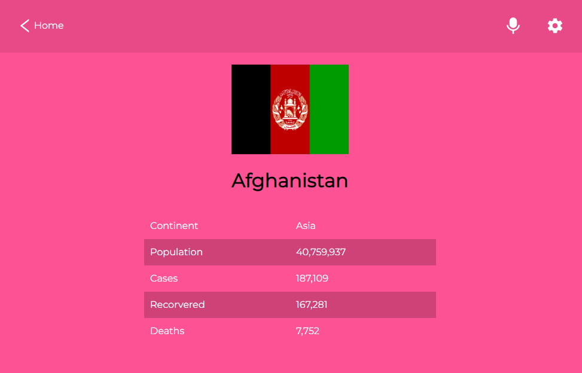
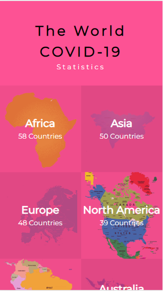
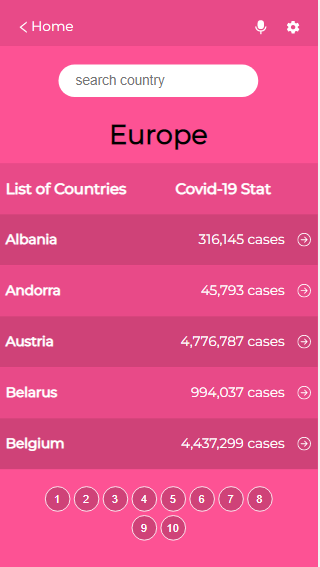
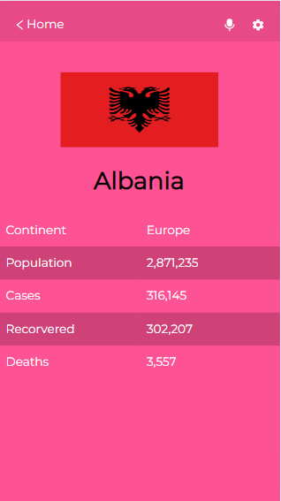

# covid-19

> This project is a web application the corona virus pandemic showing the world statistics, fetching the data from an API.


## Built With

- HTML, CSS, Javascript
- Webpack, Stylelint, ESlint, React JS, React Router, Redux, Redux Logger, Jest, Github Actions

To get a local copy up and running follow these simple example steps.


## Screenshots






### Clone this repository

To clone the repo run:
```
git clone https://github.com/NahuelJ1/covid-statistics
```
To access the cloned directory, run:
```
cd covid-19
```

## Basic Setup
### Install all dependencies

```
npm install
```

### Deployment

Run ```npm start```


## 🤝 Contributing

Contributions, issues, and feature requests are welcome!

Feel free to check the [issues page](../../issues/).

## Show your support

Give a ⭐️ if you like this project!

## Acknowledgments

- Original design idea by [Nelson Sakwa on Behance](https://www.behance.net/sakwadesignstudio).


## 📝 License

This project is [MIT](./MIT.md) licensed.
